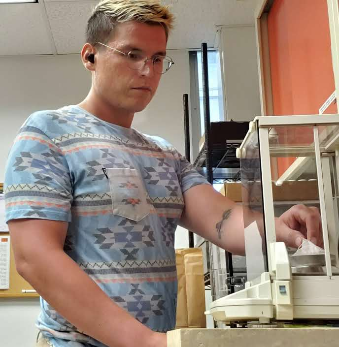

# Hey, I'm *Brett*.

> 
> ### Insert biographical paragraph here
> 
> I am a past ESIIL Stars intern, back this year as a mentor, and I'm excited to give Python another shot! 🙃

## Education:
> Current: 
> - Senior in **Env. Science & Research B.S.** at United Tribes Technical College.

> Past: 
> - Pre-Engineering A.S.
> - Computer Info. Technology A.A.S.

## Hobbies:
> - Videogames
> - Cars
> - Fitness (🏋🏼‍♂️and 🛼)
> - Anime
> - Tending to my 🐈, *Mittens*

### **Contact me via:**
> <a href="https://github.com/Wakunza" target="_blank">**GitHub**</a>  
> <a href="https://www.linkedin.com/in/brettalberts/" target="_blank">**LinkedIn**</a>  
> <a href="albertsbrett@gmail.com"> **albertsbrett@gmail.com** </a>  

